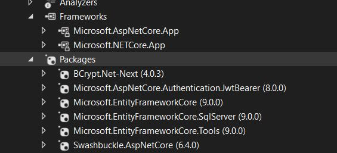
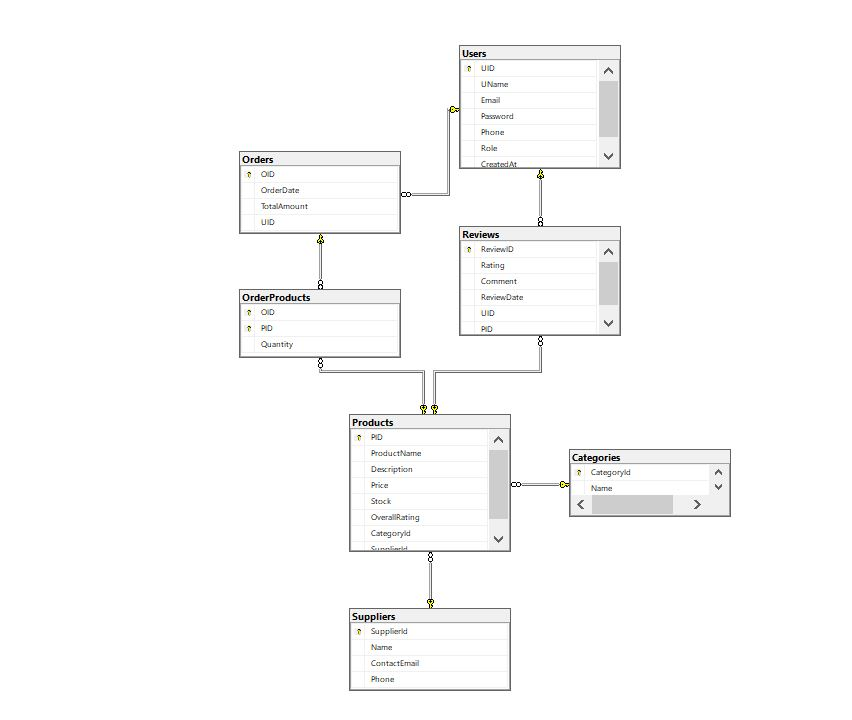

# E-CommerceSystem

## Overview
E-CommerceSystem is a comprehensive e-commerce platform designed to facilitate online shopping experiences. It provides features for product management, user authentication, order processing, and payment integration.

## Technologies Used
- **ASP.NET Core**: A cross-platform framework for building web applications and APIs.
- **Entity Framework Core**: An Object-Relational Mapper (ORM) for database interactions.
- **SQL Server**: A relational database management system for storing application data.
- **JWT (JSON Web Tokens)**: For secure user authentication and authorization.
- **Swagger**: For API documentation and testing.
- **Dependency Injection**: For managing service lifetimes and dependencies.


## App Settings
- The App Settings configuration file is a central place to manage system-level settings for the application. It allows developers to configure key parameters without modifying the source code directly, which is crucial for managing different environments (e.g., development, staging, and production).

- Any changes to the application's core settings, such as the database connection or security parameters, are handled here.

- Key configurations typically include:

1. Database Connection String: This setting specifies the information required to connect to the application's database, including the server address, database name, user credentials, and port.

2. JWT Settings: These settings control the behavior of JSON Web Tokens (JWT) for authentication. They typically include:

a. Secret Key: A unique, secure key used to sign and verify the tokens.

b. Issuer: The entity that issued the token.

c. Audience: The recipients that the token is intended for.

d. Expiration Time: How long the token remains valid before it expires.

## Launch Settings
- The launchSettings.json file is a configuration file located in the Properties folder of a .NET project. Its purpose is to define and manage how the application is launched and debugged during local development.

- It's important to understand that these settings are not used in production and are typically not deployed with the application.

- Key configurations found in launchSettings.json often include:

1. Launch Profiles: The file can define multiple launch profiles, each with its own set of settings. This allows developers to quickly switch between different ways of running the application (e.g., using IIS Express, Kestrel, or Docker).

2. Application URL: Specifies the URL and port where the application will be hosted during development (e.g., http://localhost:5000).

3. Environment Variables: Sets environment-specific variables that are needed for the application to run correctly in a development context, such as ASPNETCORE_ENVIRONMENT=Development.

4. Command Line Arguments: Defines command-line arguments that should be passed to the application when it starts.

5. Launch Browser: A boolean setting that determines whether a web browser should automatically open when the application is launched for debugging.

## Models With Data annotaions and value validation 
*note*
Data annotations and validations are included in the model definitions to ensure data integrity and enforce business rules.
such as:
- [key] => for primary keys,
- [required] => for mandatory fields,
- [maxlength] => for string length constraints,
- [range] => for numerical limits, etc.
- [RegularExpression] => for pattern matching (e.g., email format).

- [JsonIgnore] => to prevent circular references during JSON serialization.
- [ForeignKey] => to define foreign key relationships.

1. **Users Table**
   - `UID` (Primary Key): Unique identifier for each user .
   - `UName`: User's name .
   - `password`: Hashed password for security. 
   - `email`: User's email address.
   - `created_at`: Timestamp of account creation.
	- `Phone` : User's phone number.
	- `Role`: Role of the user (e.g., customer, admin , Manager).
2. **Products Table**
   - `PID` (Primary Key): Unique identifier for each product.
   - `ProductName`: Name of the product.
   - `Description`: Detailed description of the product.
   - `price`: Price of the product.
   - `stock`(quantity): Available stock for the product.
   - `OverallRating`: Average rating of the product.
3. **Reviews Table**
   - `ReviewID` (Primary Key): Unique identifier for each review.
   - `UID` (Foreign Key): References the user who wrote the review.
   - `PID` (Foreign Key): References the product being reviewed.
   - `rating`: Rating given by the user.
   - `comment`: Review comment.
   - `ReviewDate`: Timestamp of when the review was created.
4. **OrderProducts Table**
   - `OID` (Primary Key): Unique identifier for each order.
   - `PID` (Foreign Key): References the product being ordered.)
   - `Quantity`: Quantity of the product ordered.
5. **Orders Table**
   - `OID` **int**  => (Primary Key) Unique identifier for each order.
   - `UID` **int** => (Foreign Key) References the user who placed the order.
   - `OrderDate` **DateTime** =>  Timestamp of when the order was placed.
   - `TotalAmount` **Decimal** => Total amount for the order.

## Relationships description 
- A user can place multiple orders (One-to-Many relationship between Users and Orders).
- An order can contain multiple products (Many-to-Many relationship between Orders and Products, resolved through the OrderProducts table).
- A user can write multiple reviews, but each review is for a single product (One-to-Many relationship between Users and Reviews, and One-to-Many relationship between Products and Reviews).
- Each product can have multiple reviews (One-to-Many relationship between Products and Reviews).
- Each order is associated with a single user (Many-to-One relationship between Orders and Users).

## Navigation 

**Orders Table**

Each Order record is associated with a single User record.
Each Order record is associated with one or more OrderProduct records.

**OrderProducts Table**

Each OrderProduct record is associated with a single Order record.
Each OrderProduct record is associated with a single Product record.

**Products Table**

Each Product record can have multiple Review records.
Each Product record can have multiple OrderProduct records.

**Reviews Table**

Each Review record is associated with a single User record.
Each Review record is associated with a single Product record.

**Users Table**
Each User record can have multiple Order records.
Each User record can have multiple Review records.

## DB Context
**ECommerceContext Class**

  - This class inherits from DbContext and represents the session with the database.
  - It includes DbSet properties for each of the tables: Users, Products, Reviews, Orders, and OrderProducts.
  - The OnModelCreating method is overridden to configure relationships and constraints using Fluent API.

## Databse Schema 


---

## Repositories
- Each repository class implements CRUD operations for its respective entity, which mean Repositories include methods for adding, retrieving, updating, and deleting records.
- They interact with the ECommerceContext to perform database operations.
- Example: OrderProductsRepo , injecting the DbContext through the constructor to enable database operations.
    ```sql
        private readonly ApplicationDbContext _context;

        public OrderProductsRepo(ApplicationDbContext context)
        {
            _context = context;
        }

    ```
## Services with DTO
- Services contain business logic and interact with repositories to perform operations.
- Example: OrderProductsService, which uses the OrderProductsRepo to manage order products.
    ```sql
        private readonly OrderProductsRepo _orderProductsRepo;
        public OrderProductsService(OrderProductsRepo orderProductsRepo)
        {
            _orderProductsRepo = orderProductsRepo;
        }
    ```
- They handle tasks such as validating data, processing orders, and managing user accounts.
- Dto (Data Transfer Objects) are used to transfer data between layers, ensuring that only necessary information is exposed.
- DTOs help in shaping the data according to the requirements of the client or API consumers.
- DTO Example : OrderProductsDto
    ```sql
        public class OrderProductsDto
        {
            public int OID { get; set; }
            public int PID { get; set; }
            public int Quantity { get; set; }
        }
    ```
In above example, every property in the DTO corresponds to a field in the OrderProducts entity, facilitating data transfer without exposing the entire entity.

## Controllers
- Controllers handle HTTP requests and responses, acting as the entry point for API calls.
- To define a controller, it typically inherits from ControllerBase and is decorated with attributes such as [ApiController] and [Route("api/[controller]")].
- They use services to perform operations and return appropriate responses.
``` sql
private readonly IOrderService _orderService;

        public OrderController(IOrderService orderService)
        {
            _orderService = orderService;
        }

```

- They define routes and actions for creating, retrieving, updating, and deleting resources.
- Controllers ensure that the application adheres to RESTful principles, providing a structured way to interact with the e-commerce system.
- HTTP Method Mapping
    - GET => Retrieve data (e.g., get all products, get user details).
    - POST => Create new resources (e.g., create a new order, add a product).
    - PUT => Update existing resources (e.g., update user information, modify product details).
    - DELETE => Remove resources (e.g., delete a review, remove a product from the catalog).
`Example`
```sql 

[HttpPost("PlaceOrder")]

```
The above example shows a POST method in the OrderController for placing a new order.
- Each controller method corresponds to a specific action, ensuring clear and organized handling of requests.
- Method return types
    - IActionResult => Provides flexibility in returning different HTTP status codes and responses.
    - ActionResult<T> => Combines the benefits of IActionResult with strong typing, allowing for more specific return types.

`Example`
```sql
public IActionResult PlaceOrder([FromBody] List<OrderItemDTO> items)
```
The above example shows a method in the OrderController that returns an IActionResult, allowing for various HTTP responses based on the outcome of the operation.
[From Body] => indicates that the items parameter should be bound from the body of the HTTP request.
- Retrieve the Authorization header from the request
`Example`
```sql
  var token = HttpContext.Request.Headers["Authorization"].ToString().Replace("Bearer ", "");

```
Above example shows how to extract the JWT token from the Authorization header in an HTTP request.
note : This is commonly used in scenarios where the API requires authentication, and the token is needed to verify the user's identity and permissions. 

---
#### **Authentication and Authorization**
- **Authentication** is the process of verifying the identity of a user or system. This is commonly done through a login process where a user provides credentials (such as a username and password) that are then checked against a trusted database. 
`Example`
1. => User Login by email and password
```sql
[AllowAnonymous]
        [HttpGet("Login")]
        public IActionResult Login(string email, string password)
        {
            try
            {
                var user = _userService.GetUSer(email, password);
                string token = GenerateJwtToken(user.UID.ToString(), user.UName, user.Role);
                return Ok(token);

            }
            catch (Exception ex)
            {
                // Return a generic error response
                return StatusCode(500, $"An error occurred while login. {(ex.Message)}");
            }

        }
```

2. => Generate Token
```sql
[NonAction]
        public string GenerateJwtToken(string userId, string username, string role)
        {
            var jwtSettings = _configuration.GetSection("JwtSettings");
            var secretKey = jwtSettings["SecretKey"];

            var claims = new[]
            {
                new Claim(JwtRegisteredClaimNames.Sub, userId),
                new Claim(JwtRegisteredClaimNames.Name, username),
                new Claim(JwtRegisteredClaimNames.UniqueName, role),
                new Claim(JwtRegisteredClaimNames.Jti, Guid.NewGuid().ToString())

            };

            var key = new SymmetricSecurityKey(Encoding.UTF8.GetBytes(secretKey));
            var creds = new SigningCredentials(key, SecurityAlgorithms.HmacSha256);

            var token = new JwtSecurityToken(
                claims: claims,
                expires: DateTime.UtcNow.AddMinutes(Convert.ToDouble(jwtSettings["ExpiryInMinutes"])),
                signingCredentials: creds
            );

            return new JwtSecurityTokenHandler().WriteToken(token);
        }
```
3. => from token value can get user id to be able to use it in any controller

```sql
 private string? GetUserIdFromToken(string token)
        {
            var handler = new JwtSecurityTokenHandler();

            if (handler.CanReadToken(token))
            {
                var jwtToken = handler.ReadJwtToken(token);

                // Extract the 'sub' claim
                var subClaim = jwtToken.Claims.FirstOrDefault(c => c.Type == "sub");


                return (subClaim?.Value); // Return both values as a tuple
            }

            throw new UnauthorizedAccessException("Invalid or unreadable token.");
        }
```

`Explanation above code `

JwtSecurityTokenHandler: This class, from the System.IdentityModel.Tokens.Jwt library, provides the tools to read and validate JWTs.

handler.CanReadToken(token): This initial check verifies that the token's format is valid before attempting a full decode.

jwtToken.Claims: A JWT is essentially a collection of claims, which are pieces of information about the entity (e.g., the user).

Extracting the sub claim: The code specifically looks for the claim with the type "sub", which stands for "subject." This claim is a standard way to store a unique identifier for the user within the token.

Return Value: The method returns the value of the "sub" claim. The ? (null-conditional operator) ensures that null is returned if the claim is not found, preventing errors.

Security: If the token is invalid or unreadable, the method throws an UnauthorizedAccessException, which is a robust way to handle failed token validation.

4. => Through token user has access to Controllers methods that are authorized only

- **Authorization** is the process of determining what actions or resources a user or system is allowed to access.
`Example`
```sql
  var token = HttpContext.Request.Headers["Authorization"].ToString().Replace("Bearer ", "");
````
- The system uses JWT (JSON Web Tokens) for authentication and authorization.
- Users must log in to receive a token, which is then used to access protected resources.
- The token is included in the Authorization header of HTTP requests.

## API Services 
**Order Controller**

- PlaceOrder => Allows users to place a new order by providing a list of order items.
- GetOrdersByID => Retrieves all orders placed by a specific Order ID.
- GetAllOrders => Retrieves all orders in the system (admin access).

**Product Controller**

- AddProduct => Allows admins to add a new product to the catalog.
- GetAllProducts => Retrieves a list of all products.
- GetProductById => Retrieves details of a specific product by its ID.
- UpdateProduct => Allows admins to update product details.

**User Controller**
- Register => Allows new users to register by providing their details.
- Login => Authenticates users and returns a JWT token.
- GetUserById => Retrieves user details by their ID.

**Review Controller**
- AddReview => Allows users to add a review for a product.
- GetAllReviews => Retrieves all reviews for a specific product.
- DeleteReview => Allows users to delete their review by its ID.
- UpdateReview => Allows users to update their review by its ID.

## Program

- The Program.cs file is the entry point of the application.
- It sets up the web host, configures services, and defines middleware for handling HTTP requests.
- It includes configurations for authentication, authorization, and routing.
- The file also ensures that the database is created and ready for use when the application starts.
- It uses the builder pattern to configure and build the application.
- It includes middleware for handling HTTPS redirection, authentication, and authorization.

**Can we say the program class has 3 main parts:**

1. Create empty builder
```sql
var builder = WebApplication.CreateBuilder(args);
```
2. Configure services (Services Registraion)
- which register Database Connection String, Repositories, Services, Controllers, Authentication and Authorization
4. save builder as web api app
```sql
var app = builder.Build();
```
3. the HTTP request pipeline
- which include Middleware for HTTPS redirection, Authentication, Authorization, and Controller mapping.
- Use Swagger for API documentation in development environment
```sql
if (app.Environment.IsDevelopment())
            {
                app.UseSwagger();
                app.UseSwaggerUI();
            }

```
- Use HTTPS Redirection Middleware to redirect HTTP requests to HTTPS
```sql
  app.UseHttpsRedirection();

```
- Use Authentication and Authorization Middleware to protect endpoints 
```sql
app.UseAuthentication(); //jwt check middleware
app.UseAuthorization();
```
- Map Controller Endpoints to handle incoming requests
```sql
 app.MapControllers();

```
4. Run the App
```sql
app.Run();
```


## Guide to implement addtional features 

### Add a new Models
```
Category [ Fields: CategoryId, Name, Description ] [Relations: One Category → Many Products ] 
o Supplier [ SupplierId, Name, ContactEmail, Phone ] [Relation: One Supplier → Many Products ] - 
For each model implement the needed repo, service, controller and input/output DTOs along with 
implement a full crud operations logic  - 
For all the models / DTOs in the system use the Auto mapper instead of manual mapping
```

1. Models: add Category, Supplier; add FKs to Product, add unique indexes

2. DbContext: add DbSet<> + unique attribute in OnModelCreating

3. Migrations: add migration, update DB



4. DTOs: Create Create/Update/Read DTOs for Category & Supplier (and adjust Product DTOs to include Category/Supplier)

5. AutoMapper: add Profiles; register in DI

 - install autoMapperBackage
 
[](img/AutoMapperBackage1.JPG) 

- In program 
```sql
using AutoMapper; // Add this using directive for AutoMapper
//-----------------
builder.Services.AddAutoMapper(typeof(Program));

```
- Inject IMapper into service
```sql
  private readonly IMapper _mapper;
  public ReviewService(IMapper mapper)
  {
      _mapper = mapper;
  }
```
- in add method inside service add this part of code :
```sql
var review = _mapper.Map<Review>(reviewDTO, opt =>
 {
     opt.Items["pid"] = pid;
     opt.Items["uid"] = uid;
 });
```


6. Repositories: create ICategoryRepo, ISupplierRepo + EF implementations

7. Services: business logic, validation 

8. Register New repositories and services into regestraion services in program 
```sql
    builder.Services.AddScoped<ICategoryRepo, CategoryRepo>();
    builder.Services.AddScoped<ICategoryService, CategoryService>();

    builder.Services.AddScoped<ISupplierRepo, SupplierRepo>();
    builder.Services.AddScoped<ISupplierService, SupplierService>();
```
9. Controllers: full CRUD + pagination; use AutoMapper everywhere

### the main change should make to convert auto mapper from manual mapping 
1. change in the service layer and also in Controllers layer through replace manual mapping code with AutoMapper mapping code by using the _mapper instance to map between DTOs and entities 
- Example : create Reviewprofile
```sql
 // Mapping/ReviewProfile.cs
using AutoMapper;

public class ReviewProfile : Profile
{
    public ReviewProfile()
    {
        CreateMap<ReviewDto, Review>()
            .ForMember(d => d.PID,
                o => o.MapFrom((src, dest, _, ctx) => (int)ctx.Items["pid"]))
            .ForMember(d => d.UID,
                o => o.MapFrom((src, dest, _, ctx) => (int)ctx.Items["uid"]))
            .ForMember(d => d.ReviewDate,
                o => o.MapFrom(_ => DateTime.UtcNow));
    }
}

```
- Example : change in the service layer 
```sql
public Review AddReview(int pid, int uid, ReviewDto reviewDTO)
{
    var review = _mapper.Map<Review>(reviewDTO, opt =>
    {
        opt.Items["pid"] = pid;
        opt.Items["uid"] = uid;
    });
    return _reviewRepo.AddReview(review);
}
```
- In above example the manual mapping code is commented out and replaced with AutoMapper mapping code.
- The AutoMapper mapping code uses the _mapper instance to map the ReviewDto to a Review entity, passing in the pid and uid as additional context items.
- This approach simplifies the mapping process and reduces boilerplate code, making it easier to maintain and extend the service layer.


2 .Swagger config: use the HTTP Bearer scheme (not ApiKey)
- In program file 
old :
```sql
builder.Services.AddSwaggerGen(c =>
            {
                c.AddSecurityDefinition("Bearer", new OpenApiSecurityScheme
                {
                    Description = "JWT Authorization header using the Bearer scheme (Example: 'Bearer <token>')",
                    Name = "Authorization",
                    In = ParameterLocation.Header,
                    Type = SecuritySchemeType.ApiKey,
                    Scheme = "Bearer"
                });

                c.AddSecurityRequirement(new OpenApiSecurityRequirement
    {
        {
            new OpenApiSecurityScheme
            {
                Reference = new OpenApiReference
                {
                    Type = ReferenceType.SecurityScheme,
                    Id = "Bearer"
                }
            },
            new string[] {}
        }
    });
            });
```
this old setting make swagger not able to authorize the user by token , just work when put bearer token in the authorize button
new :
```sql
  builder.Services.AddSwaggerGen(c =>
{
    c.SwaggerDoc("v1", new OpenApiInfo { Title = "ECommerceSystem", Version = "v1" });
    // Add JWT Bearer token support in Swagger
    c.AddSecurityDefinition("Bearer", new OpenApiSecurityScheme
    {
        In = ParameterLocation.Header,
        Description = "Please enter JWT with Bearer into field",
        Name = "Authorization",
        Type = SecuritySchemeType.ApiKey,
        Scheme = "Bearer"
    });
    c.AddSecurityRequirement(new OpenApiSecurityRequirement
    {
        {
            new OpenApiSecurityScheme
            {
                Reference = new OpenApiReference
                {
                    Type = ReferenceType.SecurityScheme,
                    Id = "Bearer"
                }
            },
            Array.Empty<string>()
        }
    });
});
```
- With SecuritySchemeType.Http + Scheme = "bearer", you’ll paste the raw token (no “Bearer ”) and Swagger will handle the header properly.