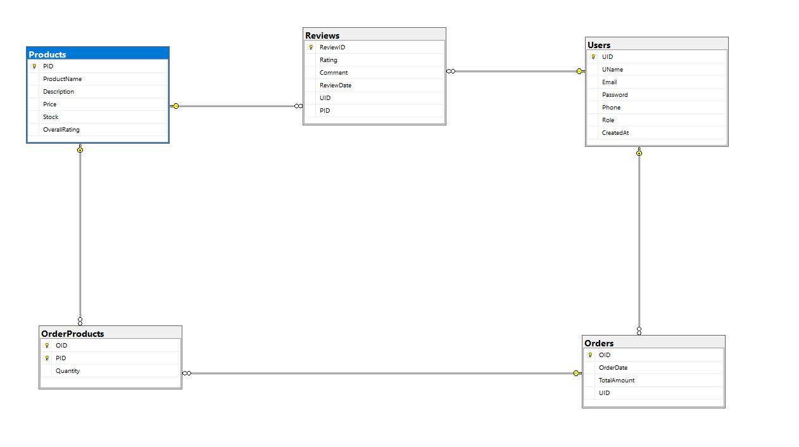

# E-CommerceSystem

## Overview
E-CommerceSystem is a comprehensive e-commerce platform designed to facilitate online shopping experiences. It provides features for product management, user authentication, order processing, and payment integration.


## Models With Data annotaions and value validation 
*note*
Data annotations and validations are included in the model definitions to ensure data integrity and enforce business rules.
such as:
- [key] => for primary keys,
- [required] => for mandatory fields,
- [maxlength] => for string length constraints,
- [range] => for numerical limits, etc.
- [RegularExpression] => for pattern matching (e.g., email format).

- [JsonIgnore] => to prevent circular references during JSON serialization.
- [ForeignKey] => to define foreign key relationships.

1. **Users Table**
   - `UID` (Primary Key): Unique identifier for each user .
   - `UName`: User's name .
   - `password`: Hashed password for security. 
   - `email`: User's email address.
   - `created_at`: Timestamp of account creation.
	- `Phone` : User's phone number.
	- `Role`: Role of the user (e.g., customer, admin , Manager).
2. **Products Table**
   - `PID` (Primary Key): Unique identifier for each product.
   - `ProductName`: Name of the product.
   - `Description`: Detailed description of the product.
   - `price`: Price of the product.
   - `stock`(quantity): Available stock for the product.
   - `OverallRating`: Average rating of the product.
3. **Reviews Table**
   - `ReviewID` (Primary Key): Unique identifier for each review.
   - `UID` (Foreign Key): References the user who wrote the review.
   - `PID` (Foreign Key): References the product being reviewed.
   - `rating`: Rating given by the user.
   - `comment`: Review comment.
   - `ReviewDate`: Timestamp of when the review was created.
4. **OrderProducts Table**
   - `OID` (Primary Key): Unique identifier for each order.
   - `PID` (Foreign Key): References the product being ordered.)
   - `Quantity`: Quantity of the product ordered.
5. **Orders Table**
   - `OID` **int**  => (Primary Key) Unique identifier for each order.
   - `UID` **int** => (Foreign Key) References the user who placed the order.
   - `OrderDate` **DateTime** =>  Timestamp of when the order was placed.
   - `TotalAmount` **Decimal** => Total amount for the order.

## Relationships description 
- A user can place multiple orders (One-to-Many relationship between Users and Orders).
- An order can contain multiple products (Many-to-Many relationship between Orders and Products, resolved through the OrderProducts table).
- A user can write multiple reviews, but each review is for a single product (One-to-Many relationship between Users and Reviews, and One-to-Many relationship between Products and Reviews).
- Each product can have multiple reviews (One-to-Many relationship between Products and Reviews).
- Each order is associated with a single user (Many-to-One relationship between Orders and Users).

## Navigation 

**Orders Table**

Each Order record is associated with a single User record.
Each Order record is associated with one or more OrderProduct records.

**OrderProducts Table**

Each OrderProduct record is associated with a single Order record.
Each OrderProduct record is associated with a single Product record.

**Products Table**

Each Product record can have multiple Review records.
Each Product record can have multiple OrderProduct records.

**Reviews Table**

Each Review record is associated with a single User record.
Each Review record is associated with a single Product record.

**Users Table**
Each User record can have multiple Order records.
Each User record can have multiple Review records.

## DB Context
**ECommerceContext Class**

  - This class inherits from DbContext and represents the session with the database.
  - It includes DbSet properties for each of the tables: Users, Products, Reviews, Orders, and OrderProducts.
  - The OnModelCreating method is overridden to configure relationships and constraints using Fluent API.

## Databse Schema 




---

## Repositories
- Each repository class implements CRUD operations for its respective entity, which mean Repositories include methods for adding, retrieving, updating, and deleting records.
- They interact with the ECommerceContext to perform database operations.
- Example: OrderProductsRepo , injecting the DbContext through the constructor to enable database operations.
    ```sql
        private readonly ApplicationDbContext _context;

        public OrderProductsRepo(ApplicationDbContext context)
        {
            _context = context;
        }

    ```
## Services
- Services contain business logic and interact with repositories to perform operations.
- Example: OrderProductsService, which uses the OrderProductsRepo to manage order products.
    ```sql
        private readonly OrderProductsRepo _orderProductsRepo;
        public OrderProductsService(OrderProductsRepo orderProductsRepo)
        {
            _orderProductsRepo = orderProductsRepo;
        }
    ```
- They handle tasks such as validating data, processing orders, and managing user accounts.


